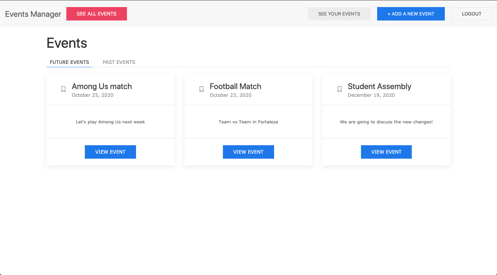

# Reddit App 


> This project consists in a event manager platform, where user can Create and Join events. The motivation is to study and apply database relationship concepts while building this application.



## Live Demo

🔗 [Live Demo Link](https://events-manager-microverse.herokuapp.com/)

## Description

I have built this project to function a working Reddit app which lets you create users, posts and comments which are unique to the users. Please follow below to get started.

## Built With 🛠
```
- Ruby: 2.6.3
- Ruby on Rails: 6.0.3.4
- Devise for authentication
- UIKit CSS
- Postgres
- VS Code
```

## Install ⏳

> Follow these steps below to get my application working

1. - [ ] Git clone or download this repo to your machine
2. - [ ] Inside the `events-manager` folder run `bundle install`
3. - [ ] Run `rails server`
4. - [ ] Visit `localhost:3000` to see the application in action

## Testing ⏳

> Follow these steps below to get my application working

Run `rspec` to run the tests

## Authors

### 👨‍💻 Diego Lira
[](https://github.com/lirad) <br>
[](https://www.linkedin.com/in/diegoalira/) <br>
[](mailto:diegoalira@gmail.com) <br>


### 🤝 Contributing

Contributions, issues and feature requests are welcome!

Feel free to check the [issues page](enter issues url here).

### Show your support

Give a ⭐️ if you like this project!

### License


